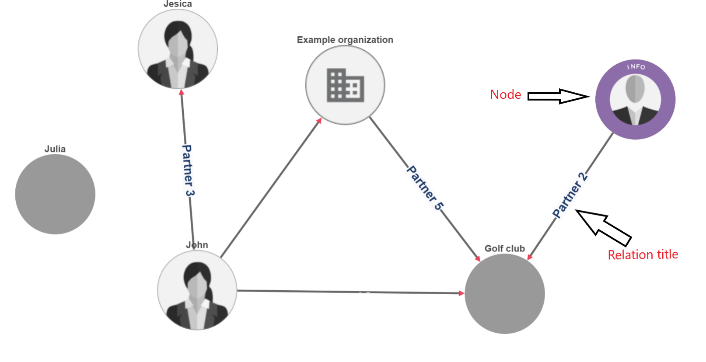

In order to run this container you'll need docker installed.

* [Windows](https://docs.docker.com/windows/started)
* [OS X](https://docs.docker.com/mac/started/)
* [Linux](https://docs.docker.com/linux/started/)

### Usage

```shell
docker run -p 9876:80 docker pull ghcr.io/polixis-tech/polixis-qa-task:latest
```


### Open localhost:9876 in browser

---



---
#### The above-displayed simple graph uses html canvas. Please identify and return by a  test code the following:

<ol>
  <li>Number of nodes which do not have an avatar.</li>
  <li>Number of edges which do not have a relation title.</li>
  <li>Number of nodes which are not connected to any other nodes.</li>
</ol>